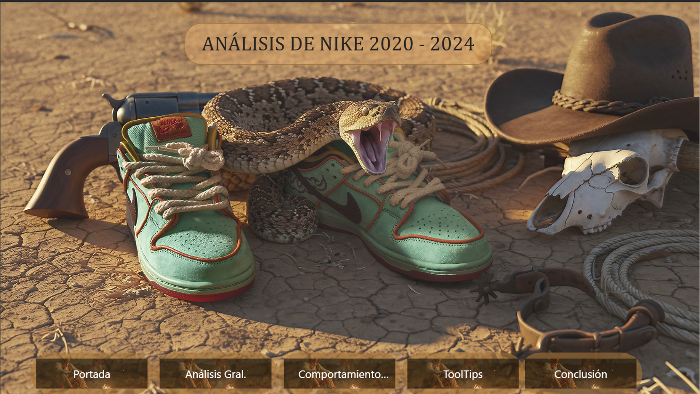
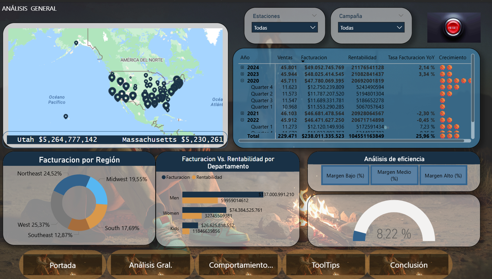

## _Descripción_
Proyecto de análisis de ventas utilizando Power BI sobre datos de productos Nike.
### _Objetivo_
Analizar el rendimiento de ventas por:
* Región
* Estado
* Categoría
* Tiempo
### _El dashboard incluye:_
* Mapa de ventas por estado
* Análisis temporal (gráfico de líneas)
* Facturación por región
* Tooltips personalizados
### _Herramientas:_
* Power BI
* Excel/CSV
* DAX
### _Insights:_
* Identificación de regiones con mayor facturación
* Evolución de ventas con el tiempo
* Comparación de rentabilidad
### _Archivos:_
* tablero_Nike.pbix: dashboard principal
### _Preview:_

